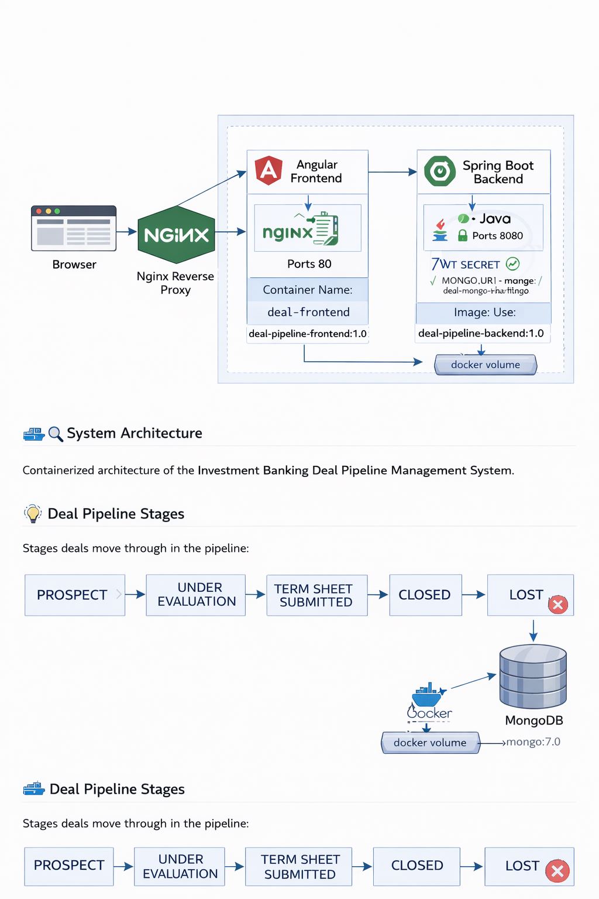

# Investment Banking Deal Pipeline Management 

## 📌 Project Overview

The **Investment Banking Deal Pipeline Management System** is a full-stack web application designed to help investment banks manage, track, and monitor deals throughout their lifecycle. It digitizes real-world investment banking workflows and provides secure, role-based access to deal data.

This project is built as a **capstone-level enterprise application** using modern technologies and best practices.

---

## 🏛️ System Architecture



---

## 🏗️ Tech Stack

### Frontend

* Angular (compiled into static files for production)
* Bootstrap

### Backend

* Java
* Spring Boot
* Spring Security
* JWT Authentication

### Database

* MongoDB

### Reverse Proxy

* Nginx (used as a reverse proxy between frontend and backend)

### DevOps & Quality

* Docker & Docker Compose
* SonarQube

---

## 🎯 Features

* User authentication & authorization (JWT)
* Role-based access control (Admin, User)
* Deal creation, update, deletion
* Deal pipeline stage tracking
* Kanban-style deal visualization
* Search & filtering
* Secure REST APIs
* Containerized deployment
* **Automatic Admin User Creation** – an admin user is created automatically when the application runs for the first time, credentials are **username**: admin, **password**: Admin@123

---

## 🔐 User Roles

### Admin

* Manage users and roles
* View all deals
* Monitor system activity
* First admin user is auto-created on first run

### User

* Create and manage deals
* Move deals across pipeline stages
* View assigned deals

---

## 🔄 Deal Pipeline Stages

1. PROSPECT
2. UNDER_EVALUATION
3. TERM_SHEET_SUBMITTED
4. CLOSED
5. LOST

---

## 🚀 Running the Project (Docker)

```bash
# Build and start all services
docker-compose up -d
```

Access:

* Frontend: `http://localhost:4200`
* Backend API: `http://localhost:8080`

---

## 📡 API Documentation

* Check the redoc-static.html

## 🗄️ Database Schema (MongoDB)

### 🧑 Users Collection

```
Users
-----
_id: ObjectId
username: String
email: String
password: String (hashed)
role: String (ADMIN | USER)
createdAt: Date
```

---

### 💼 Deals Collection

```
Deals
-----
_id: ObjectId
title: String
clientName: String
dealValue: Number
stage: String
assignedId: ObjectId
status: String
createdAt: Date
updatedAt: Date
```

---

### 🔗 Relationship Diagram

```
Users (1) ──────< (Many) Deals
Deal (1) ──────< (Many) DealNotes
```

---

## 🧪 Testing & Code Quality

* Backend unit tests
* Angular component tests
* SonarQube for static code analysis

---

## 🔒 Security

* JWT access & refresh tokens
* Password hashing
* CORS configuration
* Role-based endpoint protection

---

## 🌐 Nginx Reverse Proxy Configuration

Nginx is used as a **reverse proxy** to route requests between the frontend and backend, providing:

* A single entry point for the application
* Better security (backend not directly exposed)
* Simplified CORS handling
* Production-like deployment setup

### Request Flow

```
Browser → Nginx → Angular Frontend
                → Spring Boot Backend (API)
```


### Example Nginx Routing Logic

* `/` → Angular Frontend
* `/api/*` → Spring Boot Backend

### Sample Nginx Config

```nginx
server {
  listen 80;

  root /usr/share/nginx/html;
  index index.html;

  location / {
    try_files $uri $uri/ /index.html;
  }

  location /api/ {
    proxy_pass http://backend:8080;
    proxy_http_version 1.1;
    proxy_set_header Host $host;
    proxy_set_header X-Real-IP $remote_addr;
    proxy_set_header X-Forwarded-For $proxy_add_x_forwarded_for;
    proxy_set_header X-Forwarded-Proto $scheme;
    proxy_set_header X-Forwarded-Host $host;
  }
}
```

---

## 🚀 Containerization Steps (Windows)

This section documents **how to containerize your frontend, backend, and MongoDB using Docker and Docker Compose**.

### 1️⃣ Backend: Spring Boot

1. Build your Spring Boot project to generate a JAR file:

```bat
cd path\to\backend-project
mvn clean package
```

2. Ensure the JAR file is located at `target/deal-pipeline-backend.jar`
3. Create a `Dockerfile` for backend:

```dockerfile
FROM openjdk:17-jdk-slim
COPY target/deal-pipeline-backend.jar app.jar
EXPOSE 8080
ENTRYPOINT ["java", "-jar", "app.jar"]
```

4. Build Docker image:

```bat
docker build -t username-in-dockerhub/deal-pipeline-backend:1.0 .
```

### 2️⃣ Frontend: Angular

1. Build Angular project for production:

```bat
cd path\to\frontend-project
ng build --prod --output-path=dist/browser
```

2. Create a `Dockerfile` for frontend:

```dockerfile
# Build stage
FROM node:20-alpine AS build

WORKDIR /app
COPY package*.json ./
RUN npm install

COPY . .
RUN npm run build -- --configuration production

FROM nginx:alpine

RUN rm /etc/nginx/conf.d/default.conf

COPY nginx.conf /etc/nginx/conf.d/default.conf

COPY --from=build /app/dist/InvestmentBankingDealPipelineManagementPortalFrontEnd/browser /usr/share/nginx/html

EXPOSE 80
CMD ["nginx", "-g", "daemon off;"]

```

3. Build Docker image:

```bat
docker build -t username-in-dockerhub/deal-pipeline-frontend:1.0 .
```

### 3️⃣ MongoDB

* Using official image from Docker Hub:

```yaml
mongo:7.0
```

* Data persisted with Docker volume `mongo-data`

### 4️⃣ Docker Compose Setup

* Create `docker-compose.yml` in project root:

```yaml
version: '3.9'
services:
  mongo:
    image: mongo:7.0
    container_name: deal-mongo
    restart: unless-stopped
    volumes:
      - mongo-data:/data/db

  backend:
    image: username-in-dockerhub/deal-pipeline-backend:1.0
    container_name: deal-backend
    restart: unless-stopped
    ports:
      - "8080:8080"
    environment:
      JWT_SECRET: ${JWT_SECRET}
      MONGO_URI: mongodb://mongo:27017/app
    depends_on:
      - mongo

  frontend:
    image: username-in-dockerhub/deal-pipeline-frontend:1.0
    container_name: deal-frontend
    restart: unless-stopped
    ports:
      - "80:80"
    depends_on:
      - backend

volumes:
  mongo-data:
```

### 5️⃣ Running the Containers (Windows)

1. Open **PowerShell / CMD** in the folder with `docker-compose.yml`
2. Run:

```bat
docker-compose up -d
```

3. Check running containers:

```bat
docker ps
```

4. Access:

* Frontend: `http://localhost` (served by Nginx)
* Backend API: `http://localhost/api/...`

### 6️⃣ Environment Variables

* Create `.env` file in the same folder as `docker-compose.yml`:

```
JWT_SECRET=your_super_secret_key
```

* Docker Compose will automatically load it

### 7️⃣ Stopping Containers

```bat
docker-compose down
```

---

## 🔑 Notes

* Ensure `backend` service name matches the `proxy_pass` in Nginx config
* `depends_on` ensures backend starts after MongoDB
* Angular frontend must be built into static files before Dockerizing
* Nginx handles routing `/` to frontend and `/api/` to backend
* **First admin user is created automatically** when the application runs for the first time, credentials are **username**: admin, **password**: Admin@123

---

## 🌟 Outcome

After these steps, your project is fully containerized and can be run locally with a **single command**. The setup is **production-ready**, with MongoDB, Spring Boot backend, Angular frontend, and Nginx reverse proxy integrated.

---

## Running the Project Locally

To run the **Investment Banking Deal Pipeline Management System** on your local machine, follow these steps:

1. **Clone the repository:**

```bash
git clone https://github.com/Ehshanulla/containerized_capstone_project/
cd containerized_capstone_project
```

2. **Create a `.env` file** in the project root and add your environment variables, for example:

```
JWT_SECRET=your_super_secret_key
```

3. **Run Docker Compose** to build and start all services:

```bash
docker-compose up -d
```

4. **Access the application:**

* Frontend: [http://localhost](http://localhost)
* Backend APIs: [http://localhost/api](http://localhost/api)

5. **Stop the containers** when finished:

```bash
docker-compose down
```

> Make sure you have Docker and Docker Compose installed on your system before running these commands.

## 🚧 Future Enhancements

* Email notifications
* Advanced analytics dashboard
* AI-based deal risk scoring
* Blockchain-based audit trail

---

## 📄 License

This project is for academic and learning purposes.

---

## 🙌 Author

**Tappal Ehshanulla**
Capstone Project
